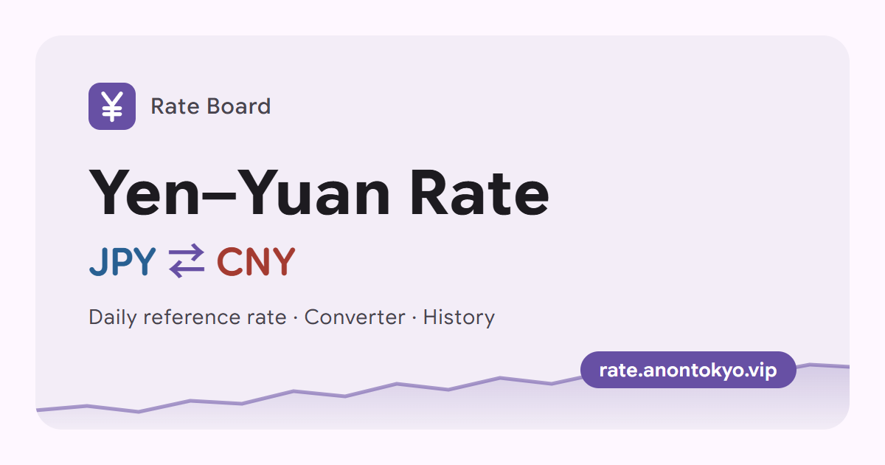

# CNY ⇄ JPY Rate Board

[简体中文](README.md) | [日本語](README.ja.md) | **English**

[](https://rate.anontokyo.vip/?lang=en)

A simple Japanese yen / Chinese yuan exchange-rate site: the daily mid-market rate, an amount converter, and history from 30 days to 1 year.

**Live site: <https://rate.anontokyo.vip/?lang=en>**

  

## Features

- **Today's rate**: the JPY ⇄ CNY mid-market rate; switch direction with one tap.
- **Converter**: converts as you type. Simple expressions work (e.g. `1980*3`, `(1200+800)/2`, full-width characters too); on phones, + − × ÷ keys appear while typing.
- **Rate on a date**: pick any day since 2005 to see that day's reference rate and what the converter's amount was worth then (weekends and holidays show the previous working day). Handy for expense reports and bookkeeping.
- **Saved amounts**: keep amounts such as rent or tuition in your browser; they are converted at the latest rate every time you visit, and one tap puts them into the converter.
- **Where today's rate sits in the past year**: the rate card shows how today's rate compares with the past year (higher than what share of days). Statistics only, no judgement.
- **History chart**: 30 days / 90 days / 180 days / 1 year, with the period's high, low and change. Hover or tap any day to see its rate and the difference from the latest value; the arrow keys step through days one at a time. Includes a 30-day moving average.
- **Three languages**: 简体中文, 日本語 and English, chosen from the device language and switchable from the language menu in the top bar. Each language has its own URL (`/`, `/?lang=ja`, `/?lang=en`) for sharing and search engines.
- **Consistent data**: every number on the page comes from the same source, so a given day's rate is the same everywhere.
- **Change from the previous day**: shown next to today's rate, compared with the previous publication day.
- **Auto-update**: if the page is left open, it refreshes once the European Central Bank publishes a new rate, and the digits roll to the new value.
- **Material 3 Expressive design**: a collapsing large-title top app bar, spring motion, connected button groups, shape-morphing loading animations and decorative shapes, and pull-to-refresh on phones. Follows the system light / dark theme by default, with a light / dark switch in the top bar; works on phones, tablets and computers (two panes on wide screens); motion follows the system "reduce motion" setting.
- **Add to home screen**: an install card at the bottom of the page (one-click install in Chrome and Edge on Android and desktop, instructions on iPhone; other Android browsers are advised to install with Chrome). Once installed it opens like an app, and long-pressing the icon jumps straight to "CNY to JPY" or "JPY to CNY".
- **Works offline**: when offline, the last fetched data is shown with a note at the top saying which day's rate it is; it refreshes automatically when you're back online.
- **One-tap copy**: tap the result or the copy button to copy the plain number without thousands separators, ready to paste into other apps.
- **Share a conversion**: opens the system share sheet on phones; other browsers copy the text and a link. Links look like `/?amount=10000&from=JPY` and open with the same conversion.
- **Next update time**: shows roughly when the European Central Bank will publish the next rate, in the visitor's time zone.
- **Keyboard shortcuts** (desktop): `/` amount, `S` switch direction, `1`–`4` chart range, `D` rate on a date, `?` show all.
- **Reachable worldwide**: no UI library; fonts and icons are all self-hosted, with no Google Fonts or other CDNs that are unreliable in mainland China.
- Free, no ads, no tracking cookies.

## Tech stack

- **Runtime**: [Cloudflare Workers](https://developers.cloudflare.com/workers/) (Static Assets serve the front end; `worker.js` handles `/api/*`)
- **Front end**: plain HTML / CSS / JavaScript, no build step, no npm dependencies; the chart is hand-written SVG
- **UI**: home-made [Material 3 Expressive](https://m3.material.io) components (`public/m3/`), no UI library. The design tokens (colour, type, shape, motion) are generated by `tools/m3-tokens.py` from the [Jetpack Compose Material 3](https://github.com/androidx/androidx/tree/androidx-main/compose/material3) source, and component sizes come from its component tokens

## Project structure

```text
cny-jpy-rate/
├── worker.js            # Worker entry: /api/rate, /api/day, /api/history; everything else goes to static assets
├── wrangler.toml        # Workers / Assets / logging config
├── public/
│   ├── index.html
│   ├── app.js           # Front-end logic, chart, motion
│   ├── i18n.js          # UI strings (zh / ja / en) and language switching
│   ├── style.css
│   ├── m3/
│   │   ├── tokens.css   # M3 system design tokens (generated by tools/m3-tokens.py)
│   │   ├── m3.css       # M3 component styles
│   │   └── m3.js        # M3 component behaviour (menu, button group, tooltip, snackbar, ripple)
│   ├── expressive.js    # M3 shape library (decorative shapes, loading indicator)
│   ├── manifest*.webmanifest  # Web App manifests (Chinese / -ja / -en; the installed name follows the language)
│   ├── sw.js            # Service Worker: network first, cache when offline
│   ├── icons/           # Web App icons
│   ├── favicon.svg
│   ├── og-image*.png    # Share-card previews (1200×630, Chinese / -ja / -en); source in docs/og-image.html
│   ├── robots.txt
│   ├── sitemap.xml
│   └── vendor/fonts/    # Self-hosted fonts
├── docs/
│   └── og-image.html    # Source of the previews (?lang=ja / en switches language)
├── tools/
│   └── m3-tokens.py     # Generates tokens.css from the Compose Material 3 source
├── CLAUDE.md            # Project notes for Claude Code
├── LICENSE
├── README.md            # Readme (简体中文)
├── README.ja.md         # 日本語
└── README.en.md         # English
```

## Local development

Requires [Node.js](https://nodejs.org):

```bash
npx wrangler dev
```

Then open <http://localhost:8787>. The API queries the upstream data sources live, so you need internet access.

## Deployment

The repository is connected to Cloudflare **Workers Builds**: pushing to `main` runs `npx wrangler deploy` automatically; no build command is needed.

[](https://deploy.workers.cloudflare.com/?url=https://github.com/Saki340/cny-jpy-rate)

To deploy your own copy: fork this repository, create a Worker under **Workers & Pages** in the Cloudflare dashboard, connect your repository, and set the deploy command to `npx wrangler deploy`. You can also run `npx wrangler deploy` locally.

## API

| Route | Description | Cache |
| --- | --- | --- |
| `GET /api/rate` | Current mid-market rate and the previous publication day; returns `{ date, cny_to_jpy, jpy_to_cny, prev_date, prev_cny_to_jpy, source }` | 10 minutes |
| `GET /api/day?date=YYYY-MM-DD` | The rate on a given day (from 2005-01-03); returns `{ requested, date, cny_to_jpy, source }`. For weekends and holidays, `date` is the previous working day | 30 days for past dates |
| `GET /api/history?days=N` | Daily history, `N` from 7 to 365 (default 90); returns `{ points: [{ date, rate }], source }` | 1 hour |

- `rate` is always JPY per 1 CNY; the front end takes the reciprocal for the other direction.
- `source` is `frankfurter` (primary) or `currency-api` (fallback), and the page says which.

## Data sources

- **Primary**: European Central Bank (ECB) reference rates via [Frankfurter](https://frankfurter.dev), updated once per working day; weekends and holidays keep the previous working day's data. The base currency in the response is checked to be CNY, so a silently ignored parameter can't produce wrong numbers.
- **Fallback**: [currency-api](https://github.com/fawazahmed0/exchange-api), used only when Frankfurter fails (jsDelivr first, the Cloudflare Pages mirror as a backup). It returns one day per request, so in fallback mode the history uses at most 20 sample days, staying within the Workers free plan's 50 subrequests per request.
- **Mastercard**: there is no public official API and the website has bot protection, so this site doesn't query it; it only links to the official converter.

All of these are mid-market rates, without any bank's or payment provider's spread.

## Development notes

- **Design tokens**: `public/m3/tokens.css` is generated; don't edit it by hand. To update to a newer Compose:

  ```bash
  python tools/m3-tokens.py <androidx commit SHA>
  ```

- **Self-hosted assets**: `public/vendor/fonts/` holds Google Sans Flex (variable, ASCII subset) and Material Symbols Rounded (variable, only the icons in use; see the README.txt there for adding icons). Chinese and Japanese use system fonts.
- **Logs**: Workers Logs are enabled in `wrangler.toml` (`[observability]`). Don't remove it, or deploying will turn off the logs enabled in the dashboard.
- **Preview images**: after editing `docs/og-image.html`, regenerate all three languages with a headless browser (the path must be an absolute `file:///` URL for `?lang=` to work):

  ```bash
  msedge --headless --hide-scrollbars --force-device-scale-factor=1 --window-size=1200,630 --screenshot=public/og-image.png "file:///D:/Project/cny-jpy-rate/docs/og-image.html"
  msedge --headless --hide-scrollbars --force-device-scale-factor=1 --window-size=1200,630 --screenshot=public/og-image-ja.png "file:///D:/Project/cny-jpy-rate/docs/og-image.html?lang=ja"
  msedge --headless --hide-scrollbars --force-device-scale-factor=1 --window-size=1200,630 --screenshot=public/og-image-en.png "file:///D:/Project/cny-jpy-rate/docs/og-image.html?lang=en"
  ```

- **Search engines**: verified in Google Search Console; the sitemap is `/sitemap.xml`. The description, canonical, Open Graph and JSON-LD in the page `<head>` are written directly in the HTML and don't depend on JS.

## Changelog

### 2026-10-08
- Added rate on a date: look up the reference rate for any day since 2005, and what the converter's amount was worth that day.
- Added a 30-day moving average to the history chart, and keyboard shortcuts on desktop.
- The top bar is now an M3 Expressive collapsing large title, with a new "More" menu (shortcuts, add to home screen, data sources and notes, GitHub).
- Pull-to-refresh on phones.
- Two-pane layout on wide screens: from 840px, today's rate and history on the left, the converter, saved amounts and other tools on the right; the chart is wider and taller on wide screens.
- Type sizes follow the M3 type scale; all card corners are 12dp, and grey cards share one colour.
- Removed the Japan tax-free calculator (Japan switches to a refund-at-departure scheme from November 2026).
- The past-year position now uses neutral wording; the footer adds a data-source note, a privacy note and a trademark notice.
- Small improvements: remembers the last conversion direction; new 404 page; 48dp touch targets; the address-bar colour follows the top bar and dark mode; fonts are cached longer and load faster; Android browsers other than Chrome suggest installing with Chrome; icon names no longer appear in search results; updated page descriptions in all three languages.

### 2026-10-06
- Redesigned in Material 3 Expressive: removed mdui and implemented the components and design tokens from the Jetpack Compose Material 3 source; spring motion, connected button groups, shape animations and large colour-block cards; icons switched to Material Symbols.
- Added Japanese and English UIs, chosen from the device language and switchable in the top bar; each language has its own URL and share preview.
- Added saved amounts, the past-year position and expression input.
- Added change from the previous day, auto-refresh, copy and share results, add to home screen (with icon long-press shortcuts) and offline use.

## License

The code is released under the [MIT License](LICENSE).

Third-party files in `public/vendor/` keep their own licenses: Google Sans Flex under the SIL Open Font License 1.1, Material Symbols under the Apache License 2.0 (see `public/vendor/fonts/README.txt`). Copyright and terms of use of the exchange-rate data belong to the respective data providers.

## Author

- Saki ([@Saki340](https://github.com/Saki340))

## Acknowledgements

This project is built on the following open data, tools and design resources, with thanks:

- [European Central Bank (ECB)](https://www.ecb.europa.eu/stats/policy_and_exchange_rates/euro_reference_exchange_rates/html/index.en.html): publishes the daily euro reference rates, the ultimate source of this site's data.
- [Frankfurter](https://frankfurter.dev) ([lineofflight/frankfurter](https://github.com/lineofflight/frankfurter), MIT): turns the ECB reference rates into a free, open-source API with no key required.
- [currency-api / exchange-api](https://github.com/fawazahmed0/exchange-api) (fawazahmed0, CC0 1.0): free exchange-rate data, this site's fallback source.
- [Jetpack Compose Material 3](https://github.com/androidx/androidx/tree/androidx-main/compose/material3) (Apache License 2.0): this site's design tokens and component sizes come from its source.
- [mdui](https://www.mdui.org) ([zdhxiong/mdui](https://github.com/zdhxiong/mdui), MIT): this site's UI component library before October 2026.
- [Material Design 3 / M3 Expressive](https://m3.material.io) (Google): the design system this site follows, including colour, spring motion, button groups, progress indicators and the shape library.
- [Google Sans Flex](https://fonts.google.com/specimen/Google+Sans+Flex), [Material Symbols](https://fonts.google.com/icons): the font and icons used on the page.
- [Cloudflare Workers](https://workers.cloudflare.com): hosting and deployment.
- [jsDelivr](https://www.jsdelivr.com), [shields.io](https://shields.io): the CDN for the fallback data and the badges in this document.

## Disclaimer

This project only provides exchange rates and conversions for reference. It is not financial, investment or legal advice, and no responsibility is accepted for any loss arising from use of its data. For actual transactions, use the rates published through official bank, payment-provider or Mastercard channels.
