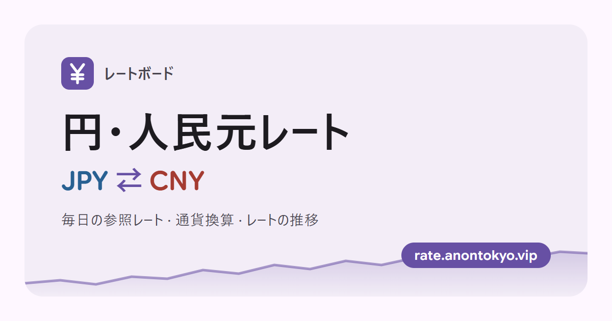
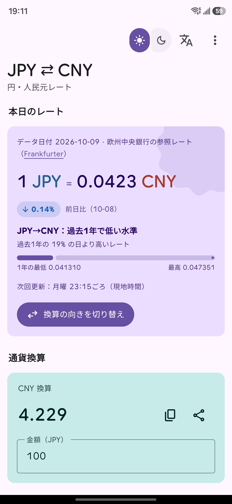
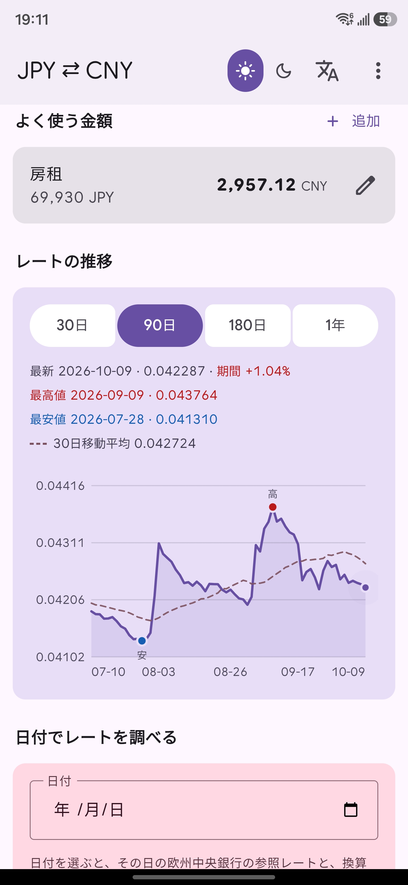

# 人民元 ⇄ 日本円 為替レートボード

[简体中文](README.md) | **日本語** | [English](README.en.md)

[](https://rate.anontokyo.vip/?lang=ja)

日本円 / 人民元の為替レートをシンプルに確認できるサイトです。毎日の仲値、金額の換算、30 日〜1 年の推移を表示します。

**サイト：<https://rate.anontokyo.vip/?lang=ja>**

  

## 機能

- **今日のレート**：欧州中央銀行の仲値。前日比と直近 1 年での位置を表示し、新しいレートが公表されると自動で更新します。
- **換算電卓**：入力するとすぐに換算。簡単な計算式（`1980*3` など）に対応し、よく使う金額の保存や結果のコピー・共有もできます。
- **推移チャート**：30 日〜1 年。最高値・最安値と 30 日移動平均線を表示。2005 年以降の任意の日のレートも調べられます。
- **キーボードショートカット**（PC）：`/` 金額入力、`S` 方向切り替え、`1`〜`4` 推移の期間切り替え、`D` 日付指定のレート、`?` 一覧表示。
- **3 言語対応**：简体中文・日本語・English。端末の言語で自動選択されます。
- **Material 3 Expressive デザイン**：ライト / ダークはシステムに合わせて切り替わり、スマートフォン・タブレット・PC に対応。
- **インストール・オフライン対応**：ホーム画面に追加してアプリのように使え、オフライン時は前回取得したデータを表示します。
- **国内外からアクセス可能**：フォントとアイコンはすべてセルフホストで、外部 CDN に依存しません。無料、広告なし、トラッキング Cookie なし。

## スクリーンショット

<p>
  
  
</p>

## 技術スタック

- **実行環境**：[Cloudflare Workers](https://developers.cloudflare.com/workers/)（Static Assets がフロントエンドを配信し、`worker.js` が `/api/*` を処理）
- **フロントエンド**：素の HTML / CSS / JavaScript。ビルド手順なし、npm 依存なし。チャートは手書きの SVG
- **UI**：自前で実装した [Material 3 Expressive](https://m3.material.io) コンポーネント（`public/m3/`）。UI ライブラリには依存しません。配色・文字サイズ・形状・モーションなどのデザイントークンは `tools/m3-tokens.py` で [Jetpack Compose Material 3](https://github.com/androidx/androidx/tree/androidx-main/compose/material3) のソースから生成し、各コンポーネントのサイズもそのコンポーネントトークンから取っています

## プロジェクト構成

```text
cny-jpy-rate/
├── worker.js            # Worker のエントリ：/api/rate、/api/day、/api/history。その他のリクエストは静的アセットへ
├── wrangler.toml        # Workers / Assets / ログの設定
├── public/
│   ├── index.html
│   ├── app.js           # フロントエンドのロジック、チャート、アニメーション
│   ├── i18n.js          # UI の文言（中 / 日 / 英）と言語切り替え
│   ├── style.css
│   ├── m3/
│   │   ├── tokens.css   # M3 システムデザイントークン（tools/m3-tokens.py で生成）
│   │   ├── m3.css       # M3 コンポーネントのスタイル
│   │   └── m3.js        # M3 コンポーネントの動作（メニュー、ボタングループ、ツールチップ、スナックバー、リップル）
│   ├── expressive.js    # M3 シェイプライブラリ（装飾図形、読み込みインジケーター）
│   ├── manifest*.webmanifest  # Web App マニフェスト（中国語 / -ja / -en。インストール後の名前が言語に合わせて変わる）
│   ├── sw.js            # Service Worker：ネットワーク優先、オフライン時はキャッシュを使用
│   ├── icons/           # Web App アイコン
│   ├── favicon.svg
│   ├── og-image*.png    # 共有カードのプレビュー画像（1200×630、中国語 / -ja / -en）。元ファイルは docs/og-image.html
│   ├── robots.txt
│   ├── sitemap.xml
│   └── vendor/fonts/    # セルフホストのフォント
├── docs/
│   ├── og-image.html    # プレビュー画像の元ファイル（?lang=ja / en で言語を切り替え）
│   └── screenshots/     # README のスマートフォンのスクリーンショット（中 / 日 / 英）
├── tools/
│   └── m3-tokens.py     # Compose Material 3 のソースから tokens.css を生成
├── CLAUDE.md            # Claude Code 向けのプロジェクト説明
├── LICENSE
├── README.md            # 説明（简体中文）
├── README.ja.md         # 日本語
└── README.en.md         # English
```

## ローカル開発

[Node.js](https://nodejs.org) が必要です：

```bash
npx wrangler dev
```

<http://localhost:8787> を開きます。API は上流のデータソースにリアルタイムでリクエストするため、インターネット接続が必要です。

## デプロイ

リポジトリは Cloudflare **Workers Builds** に接続されています。`main` ブランチにプッシュすると自動で `npx wrangler deploy` が実行されます。ビルドコマンドは不要です。

[](https://deploy.workers.cloudflare.com/?url=https://github.com/Saki340/cny-jpy-rate)

自分のコピーをデプロイする場合：このリポジトリを Fork し、Cloudflare ダッシュボードの **Workers & Pages** で Worker を作成してリポジトリを接続し、デプロイコマンドに `npx wrangler deploy` を指定します。ローカルで `npx wrangler deploy` を実行して直接デプロイすることもできます。

## API

| ルート | 説明 | キャッシュ |
| --- | --- | --- |
| `GET /api/rate` | 現在の仲値と前回の公表日。`{ date, cny_to_jpy, jpy_to_cny, prev_date, prev_cny_to_jpy, source }` を返す | 10 分 |
| `GET /api/day?date=YYYY-MM-DD` | 指定日のレート（2005-01-03 以降）。`{ requested, date, cny_to_jpy, source }` を返す。土日祝日の `date` は直前の営業日 | 過去の日付は 30 日 |
| `GET /api/history?days=N` | 日次の履歴。`N` は 7〜365（既定 90）。`{ points: [{ date, rate }], source }` を返す | 1 時間 |

- `rate` は常に 1 CNY あたりの JPY。フロントエンドが換算方向に応じて逆数を取ります。
- `source` は `frankfurter`（メイン）または `currency-api`（予備）で、ページ上にも表示されます。

## データソース

- **メイン**：欧州中央銀行（ECB）の参照レートを [Frankfurter](https://frankfurter.dev) 経由で取得。営業日ごとに 1 回更新され、土日祝日は直前の営業日のデータを使います。返された基準通貨が CNY であることを検証し、パラメータが無視された場合に誤った数字を表示しないようにしています。
- **予備**：[currency-api](https://github.com/fawazahmed0/exchange-api)。Frankfurter へのリクエストが失敗した場合のみ使用します（jsDelivr を優先し、Cloudflare Pages のミラーを予備に）。1 回に 1 日分しか取得できないため、予備モードでの推移は最大 20 サンプル日に制限し、Workers 無料プランの 1 リクエストあたり 50 サブリクエストの上限内に収めています。
- **Mastercard**：公式の公開 API がなく、公式サイトにもボット対策があるため、本サイトでは自動取得せず、公式の換算ツールへのリンクのみを提供しています。

いずれも仲値で、銀行や決済事業者の売買スプレッドは含みません。

## 開発メモ

- **デザイントークン**：`public/m3/tokens.css` はスクリプトで生成されるため、手で編集しないでください。Compose の新しいバージョンに更新するには：

  ```bash
  python tools/m3-tokens.py <androidx のコミット SHA>
  ```

- **静的アセットのセルフホスト**：`public/vendor/fonts/` には Google Sans Flex（可変フォント、ASCII サブセット）と Material Symbols Rounded（可変フォント、使用しているアイコンのみ。アイコンの追加方法は同ディレクトリの README.txt を参照）があります。中国語・日本語はシステムフォントを使います。
- **ログ**：`wrangler.toml` で Workers Logs（`[observability]`）を有効にしています。この項目を削除すると、デプロイ時にダッシュボードで有効にしたログが無効になるので削除しないでください。
- **プレビュー画像**：`docs/og-image.html` を編集したら、ヘッドレスブラウザで 3 言語分を再生成します（`?lang=` を付けるには、ファイルパスを絶対パスの `file:///` URL にする必要があります）：

  ```bash
  msedge --headless --hide-scrollbars --force-device-scale-factor=1 --window-size=1200,630 --screenshot=public/og-image.png "file:///D:/Project/cny-jpy-rate/docs/og-image.html"
  msedge --headless --hide-scrollbars --force-device-scale-factor=1 --window-size=1200,630 --screenshot=public/og-image-ja.png "file:///D:/Project/cny-jpy-rate/docs/og-image.html?lang=ja"
  msedge --headless --hide-scrollbars --force-device-scale-factor=1 --window-size=1200,630 --screenshot=public/og-image-en.png "file:///D:/Project/cny-jpy-rate/docs/og-image.html?lang=en"
  ```

- **検索エンジン**：Google Search Console で確認済み。サイトマップは `/sitemap.xml`。ページ `<head>` の description、canonical、Open Graph、JSON-LD はすべて HTML に直接書かれており、JS に依存しません。

## 更新履歴

### 2026-10-10
- トップバーに GitHub ボタンを追加（ワイド画面で表示、スマートフォンでは「その他」メニュー内）。
- テーマの切り替えをライト / ダークの 2 つにし、開くたびにシステムの設定に合わせるように変更。
- スマートフォンでトップバーの小さなタイトルが切れる問題を修正。
- 日本語・英語版の README とワンクリックデプロイボタンを追加。

### 2026-10-08
- 日付指定のレートを追加：2005 年以降の任意の日の参考レートと、電卓の金額がその日いくらになるかを確認できます。
- 推移チャートに 30 日移動平均線を追加。PC ではキーボードショートカットを追加。
- トップバーを M3 Expressive の折りたたみ式の大きなタイトルに変更し、「その他」メニュー（ショートカット、ホーム画面に追加、データソースと説明、GitHub）を追加。
- スマートフォンでプルして更新に対応。
- ワイド画面の 2 カラムレイアウト：840px 以上では左に今日のレートと推移、右に電卓・よく使う金額などのツール。ワイド画面ではチャートを広く高く表示。
- 文字サイズを M3 の規格に統一。すべてのカードの角丸を 12dp に、グレーのカードの色を統一。
- 日本の免税換算を削除（日本は 2026 年 11 月から出国時に払い戻す方式に変わるため）。
- 直近 1 年での位置を中立的な表現に変更。フッターにデータソースの説明、プライバシーについて、商標表示を追加。
- 細かな改善：前回の換算方向を記憶。404 ページを追加。ボタンのタップ領域を 48dp に拡大。アドレスバーの色がトップバーとダークモードに追従。フォントのキャッシュを長くして読み込みを高速化。Android で Chrome 以外のブラウザを使っている場合は Chrome でのインストールを案内。検索結果にアイコン名が表示されないように修正。3 言語のページ説明を更新。

### 2026-10-06
- Material 3 Expressive に基づいて UI を刷新：mdui を削除し、コンポーネントとデザイントークンを Jetpack Compose Material 3 のソースに基づいて自前で実装。スプリングアニメーション、連結ボタングループ、シェイプアニメーション、大きなカラーブロックのカード。アイコンを Material Symbols に変更。
- 日本語・英語の UI を追加。端末の言語で自動選択され、トップバーで切り替え可能。言語ごとに URL と共有プレビュー画像を用意。
- よく使う金額、直近 1 年での位置、計算式の入力を追加。
- 前日比、自動更新、結果のコピーと共有、ホーム画面への追加（アイコン長押しのショートカットを含む）、オフライン使用を追加。

## ライセンス

本プロジェクトのコードは [MIT License](LICENSE) で公開しています。

`public/vendor/` 内のサードパーティファイルはそれぞれのライセンスに従います：Google Sans Flex は SIL Open Font License 1.1、Material Symbols は Apache License 2.0（`public/vendor/fonts/README.txt` を参照）。為替データの著作権と利用条件は各データ提供元に帰属します。

## 作者

- Saki（[@Saki340](https://github.com/Saki340)）

## 謝辞

本プロジェクトは以下のオープンなデータ、ツール、デザインリソースの上に成り立っています。心より感謝します：

- [欧州中央銀行（ECB）](https://www.ecb.europa.eu/stats/policy_and_exchange_rates/euro_reference_exchange_rates/html/index.en.html)：毎日のユーロ参照レートを公開しており、本サイトの為替データの最終的な出典です。
- [Frankfurter](https://frankfurter.dev)（[lineofflight/frankfurter](https://github.com/lineofflight/frankfurter)、MIT）：欧州中央銀行の参照レートを、無料・オープンソース・キー不要の API として提供しています。
- [currency-api / exchange-api](https://github.com/fawazahmed0/exchange-api)（fawazahmed0、CC0 1.0）：無料の為替データで、本サイトの予備データソースです。
- [Jetpack Compose Material 3](https://github.com/androidx/androidx/tree/androidx-main/compose/material3)（Apache License 2.0）：本サイトのデザイントークンとコンポーネントのサイズはそのソースから取っています。
- [mdui](https://www.mdui.org)（[zdhxiong/mdui](https://github.com/zdhxiong/mdui)、MIT）：2026 年 10 月以前の本サイトの UI コンポーネントライブラリ。
- [Material Design 3 / M3 Expressive](https://m3.material.io)（Google）：本サイトが従うデザイン規格（配色、スプリングアニメーション、ボタングループ、進行状況インジケーター、シェイプライブラリなど）。
- [Google Sans Flex](https://fonts.google.com/specimen/Google+Sans+Flex)、[Material Symbols](https://fonts.google.com/icons)：ページで使用しているフォントとアイコン。
- [Cloudflare Workers](https://workers.cloudflare.com)：本サイトのホスティングとデプロイの基盤。
- [jsDelivr](https://www.jsdelivr.com)、[shields.io](https://shields.io)：予備データの CDN と、このドキュメントのバッジ。

## 免責事項

本プロジェクトは為替レートの参照と換算の参考情報を提供するのみで、金融・投資・法律上の助言を構成するものではありません。本サイトのデータの利用によって生じたいかなる損失についても責任を負いません。実際の取引には、銀行・決済事業者・Mastercard の公式チャネルが公表するレートをご確認ください。
