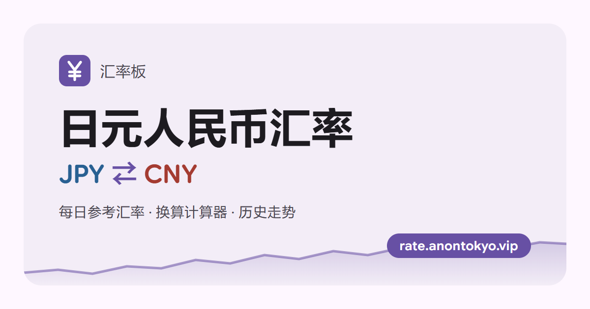

# 人民币 ⇄ 日元 汇率板

[](https://rate.anontokyo.vip)

一个简洁的日元 / 人民币汇率查询网站：每日中间汇率、金额换算、30 天至 1 年的历史走势。

**在线访问：<https://rate.anontokyo.vip>**

  

## 功能

- **今日汇率**：JPY ⇄ CNY 中间汇率，一键切换兑换方向。
- **换算计算器**：输入金额即时折算。
- **历史走势**：30 天 / 90 天 / 180 天 / 1 年，标出区间最高、最低和涨跌幅；悬停或轻点任意一天可查看当天汇率及与最新值的差距，也支持键盘方向键逐日查看。
- **数据一致**：页面上所有数字来自同一数据源，同一天的汇率在各处相同。
- **较前一日涨跌**：今日汇率旁显示与前一个公布日相比的涨跌幅。
- **自动更新**：页面开着时，欧洲央行公布新汇率后会自动刷新，数字以滚动动画变为新值。
- **Material 3 Expressive 风格**：弹簧动效、连接式按钮组、形状变形的加载动画和装饰图形；浅色 / 深色 / 跟随系统三种主题，适配手机；动效遵循系统的「减弱动态效果」设置。
- **可添加到主屏幕**：支持安装为 Web App，离线时显示上次获取的数据。
- **提示下次更新时间**：按访客所在时区显示欧洲央行下次公布汇率的大致时间。
- **国内外都能访问**：界面库和字体全部自托管，不依赖 unpkg、Google Fonts 等在中国大陆不稳定的 CDN。
- 免费、无广告、无跟踪 Cookie。

## 技术栈

- **运行环境**：[Cloudflare Workers](https://developers.cloudflare.com/workers/)（Static Assets 提供前端，`worker.js` 处理 `/api/*`）
- **前端**：原生 HTML / CSS / JavaScript，无构建步骤、无 npm 依赖；走势图为手写 SVG
- **界面组件**：[mdui 2](https://www.mdui.org/zh-cn/docs/2/)（Material Design 3 Web Components），在其上手工实现 M3 Expressive 的部分规范（`expressive.css` / `expressive.js`）

## 项目结构

```text
cny-jpy-rate/
├── worker.js            # Worker 入口：/api/rate、/api/history，其余请求交给静态资源
├── wrangler.toml        # Workers / Assets / 日志配置
├── public/
│   ├── index.html
│   ├── app.js           # 前端逻辑、走势图、动效
│   ├── style.css
│   ├── expressive.css   # M3 Expressive：弹簧动效、按钮组、进度与加载指示器、装饰形状
│   ├── expressive.js    # 形状生成（形状变形）
│   ├── manifest.webmanifest
│   ├── sw.js            # Service Worker：网络优先，离线时使用缓存
│   ├── icons/           # Web App 图标
│   ├── favicon.svg
│   ├── og-image.png     # 分享卡片预览图（1200×630），源文件 docs/og-image.html
│   ├── robots.txt
│   ├── sitemap.xml
│   └── vendor/          # 自托管的 mdui 与字体
├── docs/
│   ├── llms-full.txt    # mdui 2 官方完整文档，开发参考，不部署
│   └── og-image.html    # og-image.png 的源文件
├── CLAUDE.md            # 给 Claude Code 的项目说明
├── LICENSE
└── README.md
```

## 本地开发

需要 [Node.js](https://nodejs.org)：

```bash
npx wrangler dev
```

然后打开 <http://localhost:8787>。接口会实时请求上游数据源，需要能访问外网。

## 部署

仓库已连接 Cloudflare **Workers Builds**：推送到 `main` 分支后自动执行 `npx wrangler deploy`，无需构建命令。

如果要部署自己的副本：Fork 本仓库，在 Cloudflare 控制台的 **Workers & Pages** 中创建 Worker 并连接你的仓库，部署命令填 `npx wrangler deploy` 即可。也可以在本地运行 `npx wrangler deploy` 直接部署。

## API

| 路由 | 说明 | 缓存 |
| --- | --- | --- |
| `GET /api/rate` | 当前中间汇率及前一个公布日，返回 `{ date, cny_to_jpy, jpy_to_cny, prev_date, prev_cny_to_jpy, source }` | 10 分钟 |
| `GET /api/history?days=N` | 日线历史，`N` 为 7～365（默认 90），返回 `{ points: [{ date, rate }], source }` | 1 小时 |

- `rate` 始终为 1 CNY 兑 JPY，前端按兑换方向自行取倒数。
- `source` 为 `frankfurter`（主源）或 `currency-api`（备用源），页面会据此注明。

## 数据源

- **主源**：欧洲央行（ECB）参考汇率，经 [Frankfurter](https://frankfurter.dev) 获取，每个工作日更新一次，周末和节假日沿用上一个工作日的数据。程序会校验返回的基准货币是 CNY，避免参数被忽略时显示错误的数字。
- **备用源**：[currency-api](https://github.com/fawazahmed0/exchange-api)，仅在 Frankfurter 请求失败时使用（jsDelivr 优先，Cloudflare Pages 镜像兜底）。它每次只能查询一天，因此备用模式下的历史走势最多取 20 个采样日，以控制在 Workers 免费版每次请求 50 个子请求的限制内。
- **Mastercard**：官方没有公开接口，官网也有机器人防护，因此本站不自动查询，只提供官方换算器的链接。

以上均为中间价，不含任何银行或支付机构的买卖点差。

## 开发备注

- **静态资源自托管**：`public/vendor/mdui/` 为 mdui 2.1.5 的 `mdui.css` 与 `mdui.global.js`。升级时运行 `npm pack mdui@2`，解压后替换这两个文件。`public/vendor/fonts/` 为 Google Sans Flex（可变字体，ASCII 子集）和 Material Icons；中文使用系统字体。
- **日志**：`wrangler.toml` 中开启了 Workers Logs（`[observability]`）。请不要删除这一项，否则部署会把控制台中开启的日志关闭。
- **预览图**：编辑 `docs/og-image.html` 后，用无头浏览器重新生成：

  ```bash
  msedge --headless --hide-scrollbars --force-device-scale-factor=1 --window-size=1200,630 --screenshot=public/og-image.png docs/og-image.html
  ```

- **搜索引擎**：已在 Google Search Console 验证，sitemap 为 `/sitemap.xml`。页面 `<head>` 中的 description、canonical、Open Graph 与 JSON-LD 都直接写在 HTML 里，不依赖 JS。

## 许可证

本项目代码以 [MIT License](LICENSE) 发布。

`public/vendor/` 中的第三方文件沿用各自的许可证：mdui 为 MIT（见 `public/vendor/mdui/LICENSE.txt`）；Google Sans Flex 为 SIL Open Font License 1.1，Material Icons 为 Apache License 2.0（见 `public/vendor/fonts/README.txt`）。汇率数据的版权和使用条款归各数据提供方所有。

## 作者

- Saki（[@Saki340](https://github.com/Saki340)）

## 特别感谢

本项目建立在以下开放的数据、工具和设计资源之上，谨此致谢：

- [欧洲中央银行（ECB）](https://www.ecb.europa.eu/stats/policy_and_exchange_rates/euro_reference_exchange_rates/html/index.en.html)：公开发布每日欧元参考汇率，是本站汇率数据的最终来源。
- [Frankfurter](https://frankfurter.dev)（[lineofflight/frankfurter](https://github.com/lineofflight/frankfurter)，MIT）：把欧洲央行参考汇率整理成免费、开源、无需密钥的 API。
- [currency-api / exchange-api](https://github.com/fawazahmed0/exchange-api)（fawazahmed0，CC0 1.0）：免费的汇率数据，作为本站的备用数据源。
- [mdui](https://www.mdui.org)（[zdhxiong/mdui](https://github.com/zdhxiong/mdui)，MIT）：本站界面使用的 Material Design 3 Web Components 组件库。
- [Material Design 3 / M3 Expressive](https://m3.material.io)（Google）：本站遵循的设计规范，包括配色、弹簧动效、按钮组、进度指示器与形状库。
- [Google Sans Flex](https://fonts.google.com/specimen/Google+Sans+Flex)、[Material Icons](https://github.com/google/material-design-icons)：页面使用的字体和图标。
- [Cloudflare Workers](https://workers.cloudflare.com)：本站的托管与部署平台。
- [jsDelivr](https://www.jsdelivr.com)、[shields.io](https://shields.io)：备用数据的 CDN 和本文档中的徽章。

## 免责声明

本项目仅提供汇率查询与换算参考功能，不构成任何金融、投资或法律建议，也不对使用本站数据造成的任何损失承担责任；具体交易请以银行、支付机构或万事达官方渠道公布的汇率为准。
